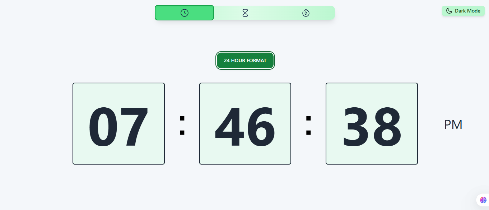
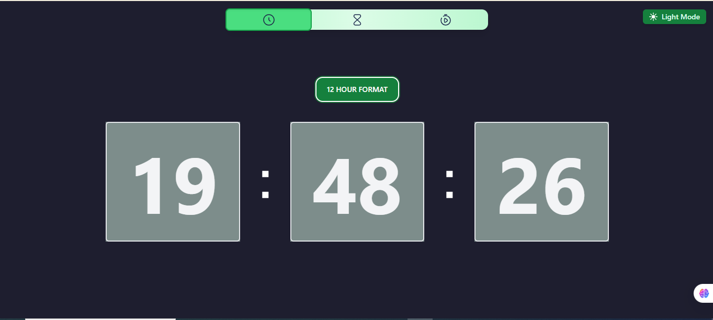
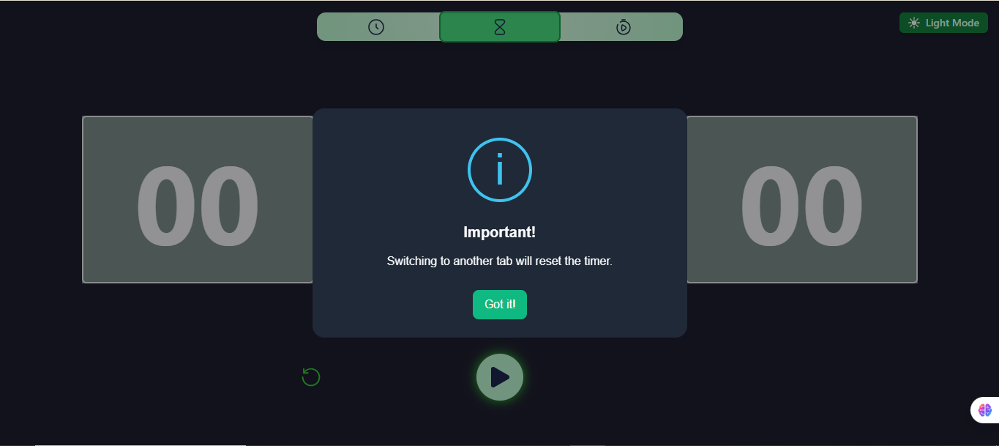
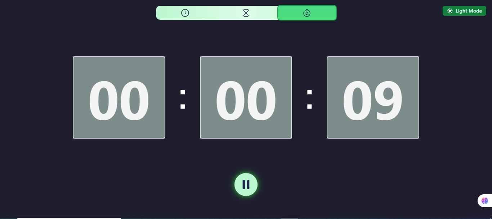
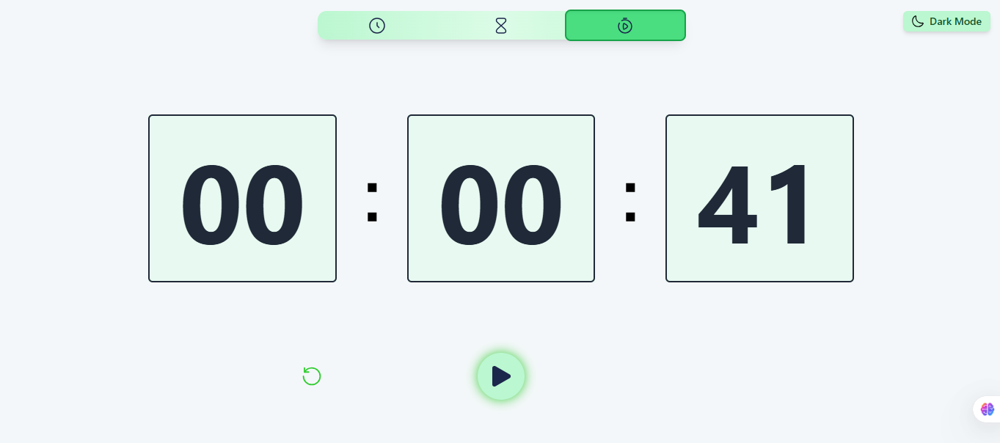

# ⏰ React Clock App

A modern and responsive Clock App built with **React.js** that includes the following features:

- 🕒 **Live Digital Clock**
- ⏳ **Timer** with customizable time and validations
- ⏱️ **Stopwatch** with second precision
- ⚡ Intuitive UI with start/pause/reset actions
- ✅ Input validation & smart user feedback (via `react-toastify` and `SweetAlert2`)
- 💡 This project includes a custom-built Dark/Light Mode toggle, allowing users to switch between themes for a better visual experience based on personal preference or environment.

🌓 Toggle between dark and light themes using a context-based system.

💾 Persistent preference saved to localStorage.

⚙️ Built with React Context API for clean state management.

---

## 🚀 Features

### 🕒 Digital Clock

- Displays real-time hours, minutes, and seconds
- Auto-updates every second
- Clean and minimal layout

### ⏳ Timer

- Set custom hours, minutes, and seconds (e.g. 00:30:00)
- Smart input validation (`00-12` for hours, `00-59` for minutes/seconds)
- Start/Pause and Reset controls
- Visual error feedback and timer completion alert

### ⏱️ Stopwatch

- Start, Pause, and Reset functionality
- second accuracy
- Real-time counter updates

---

## 📸 Screenshots

>  >  >  >  > 
